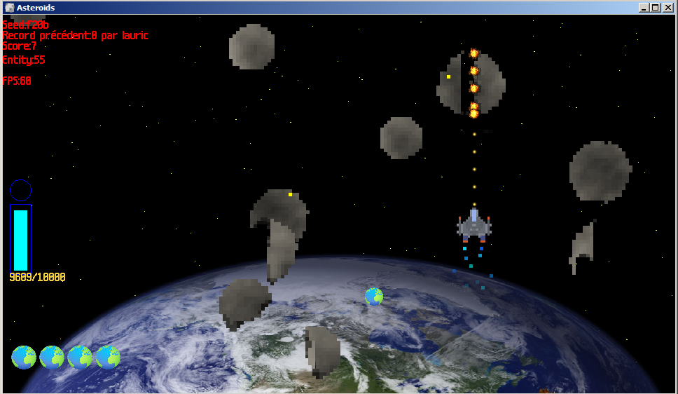

# Asteroids

Jeu experimental de destruction d'asteroids.

## Langage

Le jeu est programmé entièrement en Java et n'utilise aucune librairie autre que le jdk (version 17).
Pour le rendu graphique swing et awt sont utilisés.

## Fonctionnalités

- Génération aléatoire d'asteroid
- Séparation en plusieurs morceaux d'asteroid
- Différents types de munition.
- Sauvegarde du score
- Pause state
- Game over state

## Asteroid

Tout est programmé dans la class Asteroidv2 (La v1 est toujours dans le code).
Chaque entité possède un tableau en 2 dimensions de pixels.
Un pixel possède comme attributs une couleur et un nombre de vie initiale.
Ceux-ci ne sont pas des entités et sont régis par l'asteroid. Leurs position à l'image 
sont affiché en fonction de leur indice.

### Collision sur pixel

Les pixels n'ont pas d'hitbox propre. Il faut d'abord entrer dans l'hitbox de l'entité asteroid qui englobe les pixels.
Ensuite la méthode dealDamage() permet de déterminer la position de l'impact.

### Génération d'asteroids

Pour générer un asteroid, je commence par une forme circulaire de pixels avec l'algorithme de "perlin noise".
Ensuite, en utilisant le "flood filling" je remplis la forme à partir de son centre.
Pour finir, à chaque index marqué par un pixel, un pixel est créé avec une couleur générée par le perlin noise.

### Séparation des asteroids

Le problème est similaire à celui du "count islands".
Pour ce faire, j'utilise également le flood filling pour détecter
chaque petite partie. La fonction renvoi une liste de tableaux de pixel.
Pour chaque tableau, une nouvelle entitée de type asteroid est instantié.

## Moteur de jeu

Le moteur est un peu "cafouillis" car tout est fait par moi même. Je me suis inspiré de l'architecture "MonoBehaviour" 
comme on le retrouve dans le moteur Unity.

## Crédits

- [Noise generator](https://gist.github.com/alksily/7a85a1898e65c936f861ee93516e397d#file-noisegenerator-java)
- [Final Level by Holiznacc0](https://freemusicarchive.org/music/holiznacc0/gamer-beats/final-level/)

